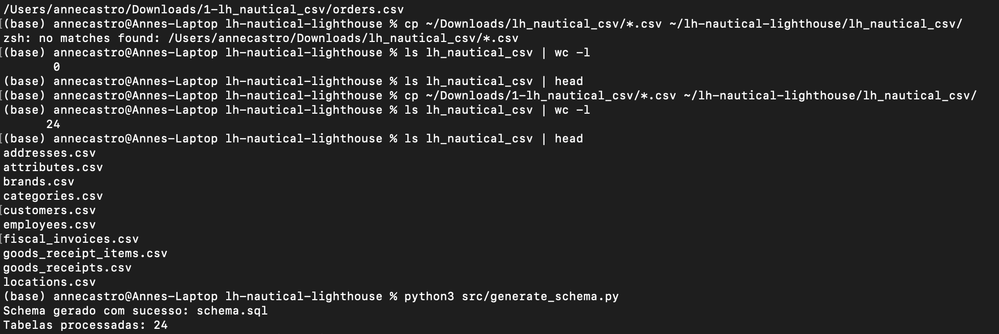
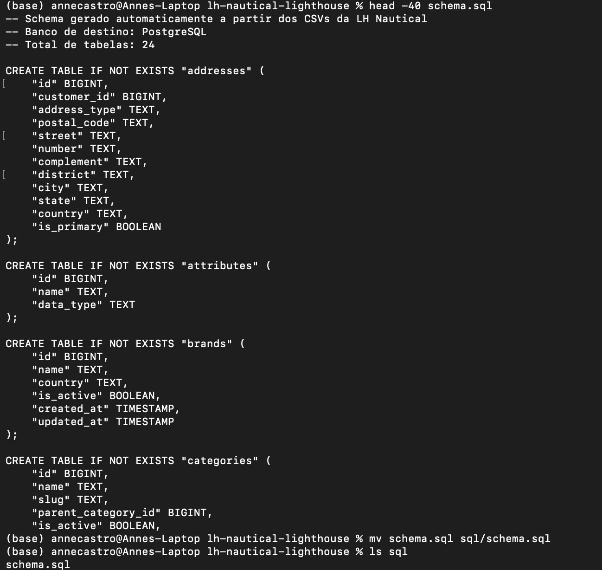

# LH Nautical | Data & Analytics Engineering

Projeto desenvolvido como parte do desafio técnico da Indicium AI, com foco em Data Engineering, Analytics Engineering e geração de insights para negócio.

O objetivo foi transformar dados operacionais de uma empresa fictícia de varejo náutico em uma plataforma analítica confiável, organizada e pronta para apoiar decisões sobre vendas, clientes, estoque, devoluções e planejamento de demanda.

## Visão geral

A LH Nautical possui operações em lojas físicas e e-commerce, além de dados relacionados a clientes, pedidos, produtos, pagamentos, estoque, fornecedores, compras e devoluções.

A base original contém:

- 24 arquivos CSV relacionais
- Dados entre 2020 e 2026
- 48.998 pedidos
- 147.320 itens de pedidos
- 53.546 pagamentos
- 2.000 clientes
- 500 produtos
- 1.009 variantes de produtos

A solução foi construída de ponta a ponta, desde a estruturação dos dados até sua disponibilização em dashboards executivos e análises preditivas.

## Arquitetura da solução

~~~mermaid
flowchart LR
    A[24 CSVs] --> B[Python + SQL]
    B --> C[PostgreSQL]
    C --> D[DBeaver]

    A --> E[Databricks Bronze]
    E --> F[Databricks Silver]
    F --> G[Databricks Gold]

    G --> H[AI/BI Dashboard]
    G --> I[Forecast]
    G --> J[Recommendation]
~~~

A arquitetura combina uma camada relacional em PostgreSQL com uma plataforma analítica em Databricks.

### PostgreSQL

Utilizado para:

- geração e validação do schema relacional
- carregamento dos arquivos CSV
- consultas SQL do desafio
- validação da estrutura dos dados
- análises exploratórias iniciais

### Databricks

Utilizado para:

- ingestão dos dados
- transformação
- validação
- modelagem analítica
- criação das métricas de negócio
- análises preditivas
- criação de views para consumo
- construção dos dashboards

## Arquitetura Medallion

A plataforma analítica foi estruturada utilizando o padrão Medallion.

### Bronze

Responsável pela preservação dos dados originais.

Os arquivos são ingeridos mantendo a estrutura da origem, criando uma camada bruta e rastreável.

Objetivos principais:

- preservar os dados recebidos
- permitir reprocessamento
- manter rastreabilidade
- evitar alterações analíticas na origem

### Silver

Responsável pela qualidade e padronização.

Nesta camada foram realizadas validações de:

- duplicidades
- IDs
- chaves compostas
- integridade referencial
- consistência financeira
- consistência temporal
- valores nulos
- tipos de dados
- padronização de strings

Nenhum valor foi preenchido ou removido de forma arbitrária.

Valores nulos foram avaliados considerando o contexto de negócio de cada tabela.

### Gold

Responsável pela camada pronta para análise e consumo.

Foram construídas estruturas como:

- dimensão de produtos
- dimensão de calendário
- fato de vendas
- fato de estoque
- fato de compras
- fato de devoluções
- condições de fornecedores
- rentabilidade de clientes
- vendas diárias
- views analíticas para dashboards

A Gold concentra as regras analíticas e métricas utilizadas na camada de consumo.

## Data Quality

A confiabilidade dos dados foi tratada como parte da arquitetura.

Principais validações realizadas:

- 24 tabelas carregadas
- 0 duplicidades exatas
- validação de IDs
- validação de chaves compostas
- integridade referencial entre tabelas
- 0 divergências entre subtotal, desconto e total dos pedidos
- 0 divergências entre quantidade, preço unitário e total dos itens
- consistência temporal validada
- análise contextual de valores nulos

Exemplos de regras verificadas:

`subtotal - discount = total`

`quantity × unit_price = line_total`

O objetivo foi garantir que os resultados analíticos fossem construídos sobre uma base confiável.

## Stack

### Data Engineering

- Databricks
- Apache Spark
- Delta Lake
- Unity Catalog
- PostgreSQL
- Python
- SQL

### Desenvolvimento

- Visual Studio Code
- DBeaver
- Git
- GitHub
- Jupyter Notebook

### Analytics e Machine Learning

- Databricks AI/BI Dashboards
- Pandas
- scikit-learn
- Similaridade de cosseno
- Séries temporais

## Resultados de negócio

A camada analítica consolidou uma visão única das operações.

### Visão executiva

Principais indicadores:

- Receita total: R$ 1,269 bi
- Pedidos: 44.151
- Ticket médio: R$ 28,7 mil
- Lucro bruto: R$ 524,8 milhões
- Margem bruta: 41,35%
- Clientes: 2.000

Essas métricas foram disponibilizadas na camada Gold e utilizadas no dashboard executivo.

## Performance por canal

A análise mostrou uma forte participação do canal digital.

### E-commerce

- Receita: R$ 890,1 milhões
- Participação aproximada: 70%

### POS

- Receita: R$ 379,0 milhões
- Participação aproximada: 30%

Apesar da diferença de participação na receita, os tickets médios dos dois canais são próximos.

No canal físico, quinta-feira apresentou a menor média de vendas:

`R$ 141,5 mil`

Esse comportamento pode apoiar decisões relacionadas a campanhas, promoções e planejamento operacional.

## Customer Analytics

Clientes de maior valor foram analisados considerando:

- ticket médio
- frequência de compras
- diversidade de categorias

Para o grupo analisado, foram considerados clientes com compras em pelo menos 13 categorias diferentes.

Entre as categorias mais consumidas:

1. Hélices: 492 itens
2. Coletes Salva-Vidas: 393 itens
3. Eletrônica Náutica: 392 itens
4. Âncoras: 387 itens

O comportamento mostra que clientes de maior valor não compram apenas mais, mas também compram de forma mais diversa.

Possíveis aplicações:

- cross-sell
- segmentação
- bundles
- campanhas personalizadas
- programas de relacionamento

## Previsão de demanda

Foi construído um baseline de previsão para o produto:

`Bússola de Bordo 702`

### Metodologia

A abordagem utiliza:

- agregação mensal
- média móvel de 3 meses
- divisão temporal entre treino e avaliação
- utilização apenas de dados anteriores ao período previsto

Esse processo evita data leakage.

### Resultado

Previsão para Q1/2026:

`149 unidades`

MAE do baseline:

`19,44 unidades`

O objetivo do baseline é fornecer uma referência simples, explicável e mensurável antes da aplicação de modelos mais sofisticados.

## Sistema de recomendação

Foi construída uma recomendação item-to-item baseada no comportamento de compra dos clientes.

### Metodologia

A solução utiliza:

- matriz cliente x produto
- interações binárias
- similaridade de cosseno

Produto de referência:

`Motor de Popa 1949`

Top 5 recomendações:

1. Motor de Popa 5331
2. Cabo Náutico 2105
3. Vela Mestra 1913
4. Cabo Náutico 9048
5. GPS Plotter 6249

O produto com maior similaridade foi:

`Motor de Popa 5331`

Score:

`0.256553`

Esse tipo de recomendação pode apoiar estratégias de cross-sell e personalização.

## Estoque

A análise operacional identificou categorias com maior volume de capital imobilizado.

Principais categorias:

- Eletrônica Náutica: R$ 833,1 mil
- Hélices: R$ 761,2 mil
- Manutenção: R$ 732,3 mil

A análise permite identificar onde existe maior concentração de capital em estoque.

Esse indicador pode ser combinado com demanda, vendas e giro para apoiar decisões de reposição.

## Devoluções

Também foram analisadas devoluções concluídas.

Categorias com maior impacto financeiro:

- Hélices: R$ 589,2 mil
- Eletrônica Náutica: R$ 479,9 mil
- Pesca: R$ 431,1 mil

Hélices aparece tanto entre as categorias mais consumidas pelos clientes de alto valor quanto entre as categorias com maior impacto financeiro de devoluções.

Esse cruzamento ajuda a direcionar análises relacionadas a:

- margem
- qualidade
- pós-venda
- fornecedores
- estoque

## Dashboards

A camada Gold alimenta dashboards construídos diretamente no Databricks AI/BI.

### Executive & Commercial Overview

Principais análises:

- receita
- pedidos
- ticket médio
- lucro bruto
- margem bruta
- evolução mensal
- performance por canal
- vendas por dia da semana
- clientes de maior valor
- categorias preferidas

### Predictive & Operations

Principais análises:

- previsão de demanda
- MAE do baseline
- recomendação de produtos
- capital imobilizado
- impacto financeiro de devoluções
- risco de estoque

## Estrutura do projeto

~~~text
lh-nautical-lighthouse/
│
├── 00_setup.ipynb
├── 01_bronze_ingestion.ipynb
├── 02_silver_transformations.ipynb
├── 03_gold_analytics.ipynb
├── 04_business_analysis.ipynb
│
├── src/
│   ├── generate_schema.py
│   ├── load_csv_to_postgres.py
│   ├── q06_demand_forecasting.py
│   ├── q07_recommendation.py
│   └── q07_recommendation_submission.py
│
├── sql/
│   ├── schema.sql
│   ├── q01_eda_orders.sql
│   ├── q04_customer_loyalty.sql
│   └── q05_calendar_dimension.sql
│
├── docs/
│   ├── executive_overview.png
│   └── predictive_operations.png
│
├── README.md
├── requirements.txt
├── .gitignore
└── LICENSE
~~~

## Notebooks Databricks

### 00_setup

Responsável pela preparação da estrutura inicial do projeto no Databricks.

Inclui:

- criação do catálogo
- criação dos schemas
- definição das camadas Bronze, Silver e Gold
- preparação dos volumes utilizados na ingestão

### 01_bronze_ingestion

Responsável pela ingestão dos arquivos CSV para a camada Bronze.

A Bronze preserva os dados recebidos e cria a base para as transformações posteriores.

### 02_silver_transformations

Responsável por:

- limpeza
- padronização
- validações
- data quality
- preparação das tabelas confiáveis

### 03_gold_analytics

Responsável pela construção da camada analítica.

Inclui:

- fatos
- dimensões
- métricas
- rentabilidade
- vendas
- estoque
- compras
- devoluções

### 04_business_analysis

Responsável pela criação das análises utilizadas no dashboard e nas respostas de negócio.

Inclui:

- KPIs executivos
- performance por canal
- comportamento semanal
- clientes de maior valor
- previsão
- recomendação
- estoque
- devoluções

## Execução local

### 1. Criar ambiente Python

~~~bash
python3 -m venv .venv
source .venv/bin/activate
~~~

### 2. Instalar dependências

~~~bash
pip install -r requirements.txt
~~~

### 3. Gerar o schema

~~~bash
python src/generate_schema.py
~~~

### 4. Criar o banco PostgreSQL

Criar um banco chamado:

`lh_nautical`

Executar o arquivo:

`sql/schema.sql`

### 5. Carregar os CSVs

~~~bash
python src/load_csv_to_postgres.py
~~~

### 6. Executar as análises SQL

As principais consultas estão disponíveis em:

~~~text
sql/q01_eda_orders.sql
sql/q04_customer_loyalty.sql
sql/q05_calendar_dimension.sql
~~~

### 7. Executar os notebooks Databricks

Executar na seguinte ordem:

~~~text
00_setup
01_bronze_ingestion
02_silver_transformations
03_gold_analytics
04_business_analysis
~~~

## Decisões de arquitetura

O projeto foi estruturado buscando separação clara de responsabilidades.

### PostgreSQL

Responsável pela camada relacional e pelas consultas SQL do desafio.

### Bronze

Responsável pela preservação da origem.

### Silver

Responsável pela confiabilidade.

### Gold

Responsável pelas regras analíticas e de negócio.

### Dashboard

Responsável pela disponibilização dos resultados para consumo.

Essa separação permite evoluir a solução sem reconstruir todo o pipeline.

## Próximas evoluções

A arquitetura atual pode evoluir para um produto de dados em produção.

### Automatização

Possíveis próximos passos:

- Auto Loader
- ingestão incremental
- Databricks Workflows
- CI/CD
- testes automatizados
- observabilidade

### Governança

Possíveis evoluções:

- lineage com Unity Catalog
- controles de acesso
- contratos de dados
- KPIs certificados
- SLA
- SLO

### Analytics e Machine Learning

Possíveis evoluções:

- previsão com sazonalidade
- modelos com variáveis externas
- MLflow
- recommendation híbrida
- alertas de estoque
- alertas de devoluções
- camada semântica
- otimização de custo e performance

## Limitações atuais

O forecast desenvolvido funciona como baseline e utiliza uma média móvel de 3 meses.

Ele ainda não considera:

- sazonalidade avançada
- promoções
- eventos externos
- tendência de longo prazo

O sistema de recomendação utiliza interações binárias.

Ele ainda não considera:

- quantidade comprada
- frequência
- recência
- preço
- margem
- características dos produtos

Esses pontos representam oportunidades naturais para próximas sprints.

## Dados

Os arquivos brutos não são versionados neste repositório.

O código, schema, consultas, notebooks e documentação necessários para entender a solução são mantidos separadamente dos dados de origem.

Essa decisão evita duplicação de arquivos pesados e mantém o repositório focado no código e na arquitetura.

## Objetivo da solução

Mais do que responder perguntas isoladas, o projeto buscou criar uma base reutilizável para análises futuras.

A arquitetura permite que novas métricas, dashboards e modelos sejam adicionados sobre uma estrutura já organizada.

O resultado final conecta:

~~~text
dados
↓
qualidade
↓
modelagem
↓
analytics
↓
decisão de negócio
~~~

## Autora

**Cleidyanne Castro Pereira**

Data Engineering | Analytics Engineering | AI

GitHub: [cleidyanne-castro](https://github.com/cleidyanne-castro)

## Licença

Este projeto utiliza a licença MIT.
